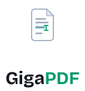

<p align="center">
  <picture>
    <source media="(prefers-color-scheme: dark)" srcset="branding/logo-stacked-dark.svg" />
    <source media="(prefers-color-scheme: light)" srcset="branding/logo-stacked-light.svg" />
    
  </picture>
</p>

<h1 align="center">GigaPDF</h1>

<p align="center">
  <strong>The self-hostable WYSIWYG PDF editor — edit text, images, forms and
  pages in your browser, with a complete REST API.<br>
  Powered by an in-house, zero-dependency Rust&nbsp;→&nbsp;WebAssembly PDF engine.<br>
  Open source, source-available under PolyForm Noncommercial 1.0.0
  (commercial licensing available).</strong>
</p>

<p align="center">
  <a href="https://github.com/QrCommunication/gigapdf/blob/main/LICENSE">
    
  </a>
  <a href="https://github.com/QrCommunication/gigapdf/blob/main/TRADEMARK.md">
    
  </a>
  <a href="https://github.com/QrCommunication/gigapdf/actions/workflows/ci.yml">
    
  </a>
  <a href="https://github.com/QrCommunication/gigapdf/actions/workflows/security.yml">
    
  </a>
  <a href="https://github.com/QrCommunication/gigapdf/stargazers">
    
  </a>
  <a href="https://giga-pdf.com">
    
  </a>
</p>

<p align="center">
  <a href="#why-gigapdf">Why GigaPDF?</a> •
  <a href="#the-engine">The Engine</a> •
  <a href="#quick-start-self-hosting">Quick Start</a> •
  <a href="#cloud-vs-self-hosting">Cloud vs Self-hosting</a> •
  <a href="#features">Features</a> •
  <a href="#contributing">Contributing</a>
</p>

---

## Why GigaPDF?

- **A real PDF engine, not a viewer overlay** — GigaPDF reads and rewrites the
  PDF content stream directly through its own
  **[gigapdf-lib](https://github.com/QrCommunication/gigapdf-lib)** engine
  (Rust, compiled to WebAssembly). Editing a paragraph actually re-flows the
  document — it doesn't just paint a sticker on top of it.
- **Zero third-party processing dependencies** — Office conversion, HTML → PDF,
  OCR, font embedding, rasterization, digital signatures and encryption are all
  built in. **No LibreOffice, no Tesseract, no Chromium, no Poppler, no MuPDF.**
  Your `docker compose` is the whole stack.
- **True WYSIWYG editing** — Edit text, images, shapes and forms directly in the
  PDF, with full font re-embedding for pixel-accurate output.
- **Self-hostable from day one** — `docker compose up` and you're running. No
  cloud lock-in, no telemetry; your documents stay on your infrastructure
  (OCR and AI search included — nothing is sent to a third party).
- **API-first design** — A complete, OpenAPI-documented REST API so you can
  embed PDF editing and processing into your own apps.

## The Engine

The heart of GigaPDF is **gigapdf-lib**, a from-scratch PDF engine written in
Rust and compiled to WebAssembly. It manipulates the PDF format at its lowest
level and ships in a single self-contained `.wasm` — no native system binaries.

| Capability | What it does |
|---|---|
| **Document editing** | Content-stream level text add/edit/remove, shapes, images, opacity, z-order — real edits, not a cosmetic overlay |
| **Redaction** | Physically removes the underlying content stream (not a black box on top) |
| **Digital signatures** | PKCS#7 / `adbe.pkcs7.detached` with your own X.509 certificate, RSA keygen included |
| **Encryption** | Standard Security Handler — read & write RC4, AES-128 and AES-256 |
| **Fonts** | TrueType / CFF / Type1 parsing, CID embedding, `ToUnicode` CMaps (no tofu), faithful re-embedding |
| **OCR** | Server-side, in-house — turns scans into searchable text with **no Tesseract** |
| **Office ⇄ PDF** | Native Word/Excel/PowerPoint/OpenDocument import & export — **no LibreOffice** |
| **HTML / URL → PDF** | Built-in HTML+CSS layout and rendering engine — **no Chromium/Playwright** |
| **Rasterization** | In-house PNG renderer (vectors + TrueType/CFF glyphs) for previews and thumbnails |
| **Crypto** | Dependency-free MD5, RC4, AES, SHA-256/512, RSA — no OpenSSL |

All of it is auditable, runs on your own infrastructure, and carries no
AGPL/GPL system-binary baggage.

## Quick start (self-hosting)

GigaPDF can be self-hosted in two ways: **Docker** (recommended) or
**native** (bare-metal / VPS).

### Option 1 — Docker (recommended)

Prerequisites: Docker 24+ with the Compose plugin.

```bash
git clone https://github.com/QrCommunication/gigapdf.git
cd gigapdf
cp .env.example .env             # edit values, especially LEGAL_*
cp apps/web/.env.example apps/web/.env.local
docker compose up -d
# App at http://localhost:3000
```

The compose stack starts six services:

| Service | Image / build | Port |
|---|---|---|
| `postgres` | `postgres:17-alpine` | 5432 |
| `redis` | `redis:8-alpine` | 6379 |
| `api` | FastAPI backend (`Dockerfile.api`) | 8000 |
| `celery-worker` + `celery-beat` | Background jobs (`Dockerfile.api`) | — |
| `web` | Next.js frontend (`Dockerfile.web`) | 3000 |
| `admin` | Admin dashboard (`Dockerfile.admin`) | 3001 |

The images are based on **Debian bookworm**. All PDF, OCR, Office conversion,
font processing and HTML rendering run inside the in-house **gigapdf-lib**
Rust → WASM engine — **no third-party system binaries are installed or
required** (no LibreOffice, Tesseract, Chromium, Poppler or fontforge).

> ⚠️ **Self-hosters must configure `NEXT_PUBLIC_LEGAL_*` env vars** in
> `apps/web/.env.local` for LCEN compliance. The web app refuses to start in
> production mode without them. See `apps/web/.env.example`.

### Option 2 — Native (bare-metal / VPS)

Prerequisites:

- **Node.js 24** + **pnpm 10**
- **Python 3.12** + venv (backend API, `requirements.txt`)
- **PostgreSQL 17** and **Redis 8**

Build and install:

```bash
git clone https://github.com/QrCommunication/gigapdf.git
cd gigapdf

# Backend (FastAPI + Celery)
python3.12 -m venv venv && source venv/bin/activate
pip install -r requirements.txt

# Frontend (Next.js web + admin + shared packages)
pnpm install && pnpm build
```

Run the services behind a reverse proxy. The repository ships systemd units
(`deploy/systemd/`) and an Nginx configuration (`deploy/nginx.conf`) whose
routing pattern is:

- `/api/pdf/*` and `/api/auth/*` → **Next.js** (`:3000`, where the PDF engine runs)
- `/api/*`, `/socket.io/*`, `/webhooks/*` → **FastAPI** (`:8000`)
- `/admin` → admin dashboard (`:3001`)
- everything else → Next.js web (`:3000`)

See [`docs/guides/INSTALLATION.md`](docs/guides/INSTALLATION.md) and
[`docs/guides/DEPLOYMENT.md`](docs/guides/DEPLOYMENT.md) for the full
walkthrough.

## Cloud vs Self-hosting

| | Cloud (giga-pdf.com) | Self-hosted |
|---|---|---|
| **Setup** | Zero config | Docker / Kubernetes |
| **Updates** | Automatic | Manual (`git pull`) |
| **Support** | Email / SLA | Community (GitHub Discussions) |
| **Cost** | Subscription | Free (your infra cost) |
| **Data residency** | EU (Scaleway, Paris) | Wherever you host |
| **Customization** | Configuration only | Full code access |

The cloud version is operated by [QR Communication SAS](https://qrcommunication.com).
The self-hosted version uses the exact same code base.

## Features

### PDF editing
- **Visual WYSIWYG editor** — Canvas-based editing with drag-and-drop and
  professional navigation: native scrolling while zoomed, cursor-anchored
  Ctrl+wheel zoom, 50–400% presets, Fit page / Fit width (Ctrl+0 / Ctrl+1),
  Space or middle-click panning
- **Text manipulation** — Add, edit, format text (bold, italic, underline,
  alignment); edits re-flow the underlying content stream
- **Faithful fonts** — Automatic identification of the PDF's fonts with
  on-demand Google Fonts download through a server-side proxy
  (`/api/fonts/google`, DB + IndexedDB cache, no client request ever reaches
  Google); the downloaded font is embedded in the final PDF
- **Images & shapes** — Insert, move, resize, restyle and delete images and
  vector shapes; opacity and z-order are baked into the document
- **Annotations** — Highlights, comments, stamps, freehand drawings
- **Form designer** — Design and fill interactive PDF forms: text, multiline,
  date, checkbox, radio groups and dropdowns with editable options; required /
  read-only fields, defaults, max length and tab-order reordering; Design /
  Fill modes with highlighting of the document's existing fields and flattening
  after filling
- **Layers & multi-selection** — Persistent layer groups with per-element
  visibility and locking; batch-edit opacity, colors and alignment across a
  multi-selection

### Document operations
- Page management (add, remove, reorder, rotate, duplicate, extract)
- Merge & split documents — including **universal merge**
  (`POST /api/pdf/merge-universal`): any combination of PDF, Word, Excel,
  PowerPoint, OpenDocument, images, HTML, text and RTF files is accepted; each
  is converted automatically before merging
- Compression with the achieved ratio shown before applying
- Encryption & password protection (RC4 / AES-128 / AES-256), and unlocking
- **Digital signatures (PKCS#7)** with your own P12/PFX certificate —
  processed in memory only, never stored
- **Redaction** — content is physically removed from the PDF, not just masked
- Watermarking (single page or whole document)
- PDF/A conversion
- **OCR** — server-side text recognition on scans and images, built on
  state-of-the-art PaddleOCR models run through an in-house runtime (no
  Tesseract, no third-party service): a dozen printed scripts — Latin, Cyrillic,
  Arabic, Hebrew, Indic (Devanagari, Tamil, Telugu, Kannada) and CJK — plus
  opt-in Latin (French included), Cyrillic and Greek handwriting; with a
  "searchable PDF" mode that adds an invisible text layer to image-only pages
- Conversion (HTML → PDF, URL → PDF; Word, Excel, PowerPoint and OpenDocument
  ⇄ PDF — import `.doc`/`.docx`/`.xls`/`.xlsx`/`.ppt`/`.pptx`/`.odt`/`.ods`/`.odp`/`.rtf`/`.md`/`.csv`/`.txt`/`.html`,
  export DOCX/XLSX/PPTX/ODT/ODP/RTF/HTML/Markdown/text and EPUB; images ⇄ PDF;
  all processed natively by gigapdf-lib)
- Sharing (email invitations, public links) and a document detail page with
  version history, one-click restore and activity history

### Document management
- Trash with restore — deleted documents are recoverable for 30 days, then
  purged automatically
- Tags with filtering and autocomplete
- Full-text search across document names and content (PostgreSQL `tsvector` +
  GIN index)
- **Semantic document search** (`GET /api/v1/search/semantic`) — vector search
  across document contents, with embeddings computed **locally** on your own
  infrastructure (no external AI service)
- **Global command palette** (Ctrl/Cmd+K) — navigate to any tool or page and
  trigger semantic search from anywhere in the app
- Real thumbnails generated at upload and refreshed after editing
- Document duplication, folder organization & renaming
- Parallel uploads (3 concurrent)

### Public site & localization
- Bilingual app — interface in French and English; public pages are served
  under locale-prefixed URLs (French by default, English under `/en/*`) with
  per-page canonical and `fr`/`en`/`x-default` hreflang
- **36 PDF tools** with a "Features" mega-menu listing them all by category,
  available on every page of the marketing site
- 48 SEO guide pages (36 PDF tools, 10 professions, 2 hubs) written in both
  languages with localized slugs and JSON-LD structured data
  (SoftwareApplication, HowTo, FAQPage)

### Developer tools
- **REST API** — Complete OpenAPI spec, see `docs/api/`
- **Webhooks** — Document lifecycle events
- **Real-time collaboration** — WebSocket-based: live element sync on the
  canvas, multiple cursors

## Architecture

GigaPDF is a pnpm + Turbo monorepo:

```
apps/
  web/        Next.js 16 frontend + PDF API routes (/api/pdf, /api/auth, /api/fonts)
  admin/      Admin dashboard (Next.js 16)
  mobile/     Expo / React Native app
packages/
  pdf-engine/ TypeScript layer that drives the gigapdf-lib WASM engine
  canvas/     Fabric.js editor canvas
  editor/     React editor components
  embed/      Embeddable widget
  billing/    Stripe integration (optional)
  api/        TypeScript API client
  ui/         Shared UI components (shadcn-based)
  ...
```

- **Frontend**: Next.js 16, React 19, Fabric.js, better-auth, Prisma, Zustand,
  TanStack Query, Tailwind CSS v4.
- **Backend**: FastAPI (Python 3.12), Celery + Celery Beat, Socket.IO,
  PostgreSQL 17 (with `pgvector`), Redis 8, offline `fastembed` embeddings,
  Stripe for billing.
- **PDF engine**: [gigapdf-lib](https://github.com/QrCommunication/gigapdf-lib)
  — Rust compiled to WebAssembly, zero third-party dependency, consumed from
  `packages/pdf-engine` and the `/api/pdf/*` routes.

See [`docs/ARCHITECTURE.md`](docs/ARCHITECTURE.md) for details.

## Contributing

Contributions are welcome! Please:

1. Read [CONTRIBUTING.md](CONTRIBUTING.md)
2. Sign your commits with DCO: `git commit -s` (every commit, no exceptions)
3. Read the [Code of Conduct](CODE_OF_CONDUCT.md)

## Security

Found a vulnerability? **Do not open a public issue.** See [SECURITY.md](SECURITY.md)
for the private reporting process (GitHub Security Advisory or
contact@qrcommunication.com).

## License & Trademark

GigaPDF has **two distinct licensing regimes**:

### Code: PolyForm Noncommercial 1.0.0 (source-available)

The source code is source-available under [PolyForm Noncommercial 1.0.0](LICENSE):
free to use, study, modify and redistribute for any **noncommercial** purpose.
**Commercial use requires a separate license** — contact QR Communication at
<contact@qrcommunication.com> to discuss it.

### Name & logo: Trademarks of QR Communication SAS

The "GigaPDF" name and logo are trademarks of **QR Communication SAS**.
**Forks with code modifications must rebrand entirely** (different name,
different logo, different domain). See [TRADEMARK.md](TRADEMARK.md) for details.
Logo assets are in [`branding/`](branding/) under [CC-BY-ND 4.0](branding/LICENSE).

## About

GigaPDF is built and maintained by [QR Communication](https://qrcommunication.com),
a Paris-based company.

- 🌐 **Cloud version**: https://giga-pdf.com
- 💬 **Discussions**: https://github.com/QrCommunication/gigapdf/discussions
- 📧 **Contact**: contact@qrcommunication.com
- 🐛 **Issues**: https://github.com/QrCommunication/gigapdf/issues
