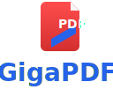

<p align="center">
  
</p>

<h1 align="center">GigaPDF</h1>

<p align="center">
  <strong>The self-hostable WYSIWYG PDF editor — edit text, images and forms
  in your browser, with a complete REST API and embeddable widget.<br>
  Open source under AGPLv3.</strong>
</p>

<p align="center">
  <a href="https://github.com/QrCommunication/gigapdf/blob/main/LICENSE">
    
  </a>
  <a href="https://github.com/QrCommunication/gigapdf/blob/main/TRADEMARK.md">
    
  </a>
  <a href="https://github.com/QrCommunication/gigapdf/actions">
    
  </a>
  <a href="https://github.com/QrCommunication/gigapdf/stargazers">
    
  </a>
  <a href="https://giga-pdf.com">
    
  </a>
</p>

<p align="center">
  <a href="#why-gigapdf">Why GigaPDF?</a> •
  <a href="#quick-start-self-hosting">Quick Start</a> •
  <a href="#cloud-vs-self-hosting">Cloud vs Self-hosting</a> •
  <a href="#features">Features</a> •
  <a href="#contributing">Contributing</a>
</p>

---

## Why GigaPDF?

- **True WYSIWYG editing** — Edit text directly in PDFs (not just annotate),
  thanks to a Fabric.js canvas layered on top of pdfjs-dist with full font
  re-embedding for accurate output.
- **Self-hostable from day one** — `docker compose up` and you're running.
  No cloud lock-in, no telemetry, your data stays on your infrastructure.
- **API-first design** — Complete REST API (OpenAPI documented) plus an
  embeddable widget so you can integrate PDF editing into your own apps.

## Quick start (self-hosting)

```bash
git clone https://github.com/QrCommunication/gigapdf.git
cd gigapdf
cp .env.example .env             # edit values, especially LEGAL_*
cp apps/web/.env.example apps/web/.env.local
docker compose up -d
# App at http://localhost:3000
```

> ⚠️ **Self-hosters must configure `NEXT_PUBLIC_LEGAL_*` env vars** in
> `apps/web/.env.local` for LCEN compliance. The web app refuses to start in
> production mode without them. See `apps/web/.env.example`.

## Cloud vs Self-hosting

| | Cloud (giga-pdf.com) | Self-hosted |
|---|---|---|
| **Setup** | Zero config | Docker / Kubernetes |
| **Updates** | Automatic | Manual (`git pull`) |
| **Support** | Email / SLA | Community (GitHub Discussions) |
| **Cost** | Subscription | Free (your infra cost) |
| **Data residency** | EU (Scaleway, Paris) | Wherever you host |
| **Customization** | Configuration only | Full code access |

The cloud version is operated by [QR Communication SAS](https://qrcommunication.com).
The self-hosted version uses the exact same code base.

## Features

### PDF Editing
- **Visual WYSIWYG editor** — Canvas-based editing with drag-and-drop
- **Text manipulation** — Add, edit, format text with full font support
- **Images & shapes** — Insert, resize, position visual elements
- **Annotations** — Highlights, comments, stamps, freehand drawings
- **Form builder** — Create and fill interactive PDF forms

### Document operations
- Page management (add, remove, reorder, rotate)
- Merge & split documents
- Encryption & password protection
- OCR (text extraction from scans, fra+eng default)
- Conversion (HTML → PDF, URL → PDF via Playwright)

### Developer tools
- **REST API** — Complete OpenAPI spec, see `docs/api/`
- **Embed widget** — `<script src=".../embed.js">` integration
- **Webhooks** — Document lifecycle events
- **Real-time collaboration** — WebSocket-based, multiple cursors

## Architecture

GigaPDF is a pnpm + Turbo monorepo:

```
apps/
  web/        Next.js 16 frontend + API routes
  admin/      Admin dashboard
  mobile/     Expo / React Native app
packages/
  pdf-engine/ TypeScript PDF processing (pdfjs-dist + pdf-lib + Playwright)
  canvas/     Fabric.js editor canvas
  editor/     React editor components
  embed/      Embeddable widget
  billing/    Stripe integration (optional)
  api/        TypeScript API client
  ui/         Shared UI components (shadcn-based)
  ...
```

See [`docs/architecture.md`](docs/architecture.md) for details.

## Contributing

Contributions are welcome! Please:

1. Read [CONTRIBUTING.md](CONTRIBUTING.md)
2. Sign your commits with DCO: `git commit -s` (every commit, no exceptions)
3. Read the [Code of Conduct](CODE_OF_CONDUCT.md)

## Security

Found a vulnerability? **Do not open a public issue.** See [SECURITY.md](SECURITY.md)
for the private reporting process (GitHub Security Advisory or
contact@qrcommunication.com).

## License & Trademark

GigaPDF has **two distinct licensing regimes**:

### Code: GNU AGPL-3.0-or-later

The source code is licensed under [AGPL-3.0-or-later](LICENSE). Any modified
version used to provide a network service must publish its source code.

### Name & logo: Trademarks of QR Communication SAS

The "GigaPDF" name and logo are trademarks of **QR Communication SAS**.
**Forks with code modifications must rebrand entirely** (different name,
different logo, different domain). See [TRADEMARK.md](TRADEMARK.md) for
details. Logo assets are in [`branding/`](branding/) under
[CC-BY-ND 4.0](branding/LICENSE).

## About

GigaPDF is built and maintained by [QR Communication](https://qrcommunication.com),
a Paris-based company.

- 🌐 **Cloud version**: https://giga-pdf.com
- 💬 **Discussions**: https://github.com/QrCommunication/gigapdf/discussions
- 📧 **Contact**: contact@qrcommunication.com
- 🐛 **Issues**: https://github.com/QrCommunication/gigapdf/issues
